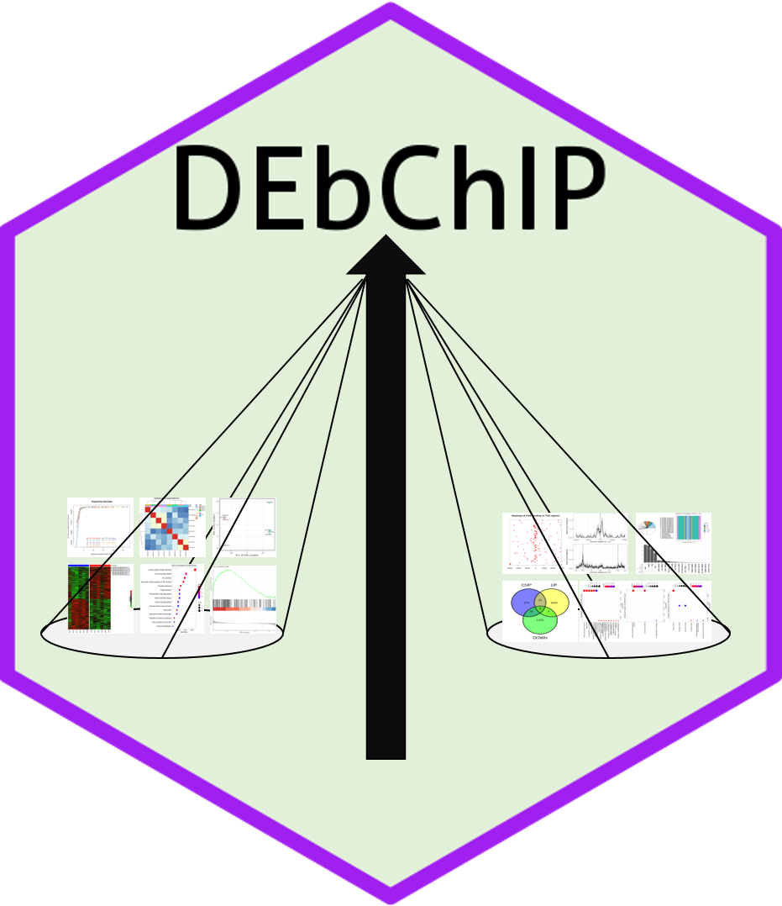

# DEbChIP - Toolbox to explore, visualize, interpret RNA-seq data and integrate with ChIP-seq data.



## Introduction
The goal of DEbChIP is to assist in the processing of RNA-seq data. It contains **six functional modules**:

* **Quality Control (QC)**: QC on count matrix and samples. 
  - QC on count matrix: Proportion of genes detected in different samples under different CPM thresholds and the saturation of the number of genes detected.
  - QC on samples: Euclidean distance and pearson correlation coefficient of samples across different conditions, sample similarity on selected principal components (check batch informatio and conduct batch correction) and outlier detection with robust PCA.
* **Principal Component Analysis (PCA)**: this module can be divided into three sub modules, basic info, loading related and 3D visualization.
  - basic info: screen plot (help to select the useful PCs), biplot (sample similarity with corresponding loading genes) and PC pairs plot (sample similarity under different PC combinations).
  - loading related: visualize positive and negative loading genes on selected PCs, conduct GO enrichment analysis on selected loading genes of selected PC.
  - 3D visualization: visualize samples on three selected PCs.
* **Differential Expression Gene Visualization**: this module includes six powerful visualization methods (Volcano Plot, Scatter Plot, MA Plot, Rank Plot, Gene Plot, Heatmap).
* **Functional Enrichment Analysis (FEA)**: GO enrichment analysis, KEGG enrichment analysis, Gene Set Enrichment Analysis (GSEA).
  - GO (Biological Process, Molecular Function, Cellular Component) and KEGG on differential expression genes
  - GSEA on all genes
* **Integrate with ChIP-seq**: 
  - Get consensus peaks: For multiple peak files, get consensus peaks; for single peak file, use it directly
  - Peak profile plots: Heatmap of ChIP binding to TSS regions, Average Profile of ChIP peaks binding to TSS region, Profile of ChIP peaks binding to different regions.
  - Peak annotaion
  - Integrate with RNA-seq: Integrate with RNA-seq to find direct targets, including up-regulated and down-regulated.
  - Integrate summary: Summary the integrated results, get the overlap number of up-regulated genes and ChIP-seq results (UP), down-regulated genes and ChIP-seq results.
  - GO enrichment on integrated results: GO enrichment on up-regulated targets and down-regulated targets.
* **Utils**: useful functions when dealing with RNA-seq data, including gene name conversion and count normalization(DESeq2’s median of ratios, TMM, CPM, TPM, RPKM).

To enhance the ease of use of the tool, we have also developed an **interactive tool** for `DEbChIP` that allows users to submit files to the web page and set parameters to get the desired results. Unlike the standalone R package, *the interactive web page has built-in `DESeq2` for differential expression analysis*, while the R package can accept user input results from `DESeq2` or `edgeR`, which will be **more flexible**.

By the way, all plots generated are **publication-ready** , and most of them are based on `ggplot2`, so that users can easily modify them according to their needs. We also provide **various color palettes**, including **discrete** and **continuous**, **color blind friendly** and **multiple categorical variables**.

<hr />

## Installation
You can install the released version of `DEbChIP` from [Bioconductor](https://bioconductor.org/) with:
```R
if (!requireNamespace("BiocManager", quietly = TRUE))
    install.packages("BiocManager")

BiocManager::install("DEbChIP")
```

Or install the package via the Github repository:

``` r
# install.package("remotes")   #In case you have not installed it.
remotes::install_github("showteeth/DEbChIP")
```

<hr />

## Usage
### Vignette
Detailed usage is available in [vignette](https://github.com/showteeth).

### Function list
<table>
<thead>
  <tr>
    <th>Type</th>
    <th>Function</th>
    <th>Usage</th>
  </tr>
</thead>
<tbody>
  <tr>
    <td rowspan="4">Quality Control</td>
    <td><code>CountQC</code></td>
    <td>Quality control on count matrix</td>
  </tr>
  <tr>
    <td><code>SampleRelation</code></td>
    <td>Quality control on samples</td>
  </tr>
  <tr>
    <td><code>OutlierDetection</code></td>
    <td>Detect outlier with robust PCA</td>
  </tr>
  <tr>
    <td><code>QCPCA</code></td>
    <td>PCA related functions used in quality control (batch correction and outlier detection)</td>
  </tr>
  <tr>
    <td rowspan="6">Principal Component Analysis</td>
    <td><code>PCA</code></td>
    <td>Conduct principal component analysis</td>
  </tr>
  <tr>
    <td><code>PCABasic</code></td>
    <td>Generated PCA baisc plots, including screen plot, biplot and pairs plot</td>
  </tr>
  <tr>
    <td><code>ExportPCGenes</code></td>
    <td>Export genes of selected PCs</td>
  </tr>
  <tr>
    <td><code>LoadingPlot</code></td>
    <td>PCA loading plot, including bar and heatmap</td>
  </tr>
  <tr>
    <td><code>LoadingGO</code></td>
    <td>GO enrichment on PC's loading genes</td>
  </tr>
  <tr>
    <td><code>PCA3D</code></td>
    <td>Create 3D PCA plot</td>
  </tr>
  <tr>
    <td rowspan="8">Differential Axpression Analysis</td>
    <td><code>ExtractDEG</code></td>
    <td>Extract Differentially Expressed Genes</td>
  </tr>
  <tr>
    <td><code>VolcanoPlot</code></td>
    <td>VolcanoPlot for Differentially Expressed Genes</td>
  </tr>
  <tr>
    <td><code>ScatterPlot</code></td>
    <td>ScatterPlot for Differentially Expressed Genes</td>
  </tr>
  <tr>
    <td><code>MAPlot</code></td>
    <td>MA-plot</td>
  </tr>
  <tr>
    <td><code>RankPlot</code></td>
    <td>Rank plot for Differentially Expressed Genes</td>
  </tr>
  <tr>
    <td><code>GenePlot</code></td>
    <td>Gene expresion plot</td>
  </tr>
  <tr>
    <td><code>DEHeatmap</code></td>
    <td>Heatmap for Differentially Expressed Genes</td>
  </tr>
  <tr>
    <td><code>ConductDESeq2</code></td>
    <td>Conduct Differential Axpression Analysis with DESeq2</td>
  </tr>
  <tr>
    <td rowspan="2">Functional Enrichment Analysis</td>
    <td><code>ConductFE</code></td>
    <td>Conduct Functional Enrichment Analysis</td>
  </tr>
  <tr>
    <td><code>ConductGSEA</code></td>
    <td>Conduct Gene Set Enrichment Analysis (GSEA)</td>
  </tr>
  <tr>
    <td rowspan="6">Integrate with ChIP-seq</td>
    <td><code>GetConsensusPeak</code></td>
    <td>Get Consensus Peak with MSPC</td>
  </tr>
  <tr>
    <td><code>PeakProfile</code></td>
    <td>Create ChIP Peak Binding Profile</td>
  </tr>
  <tr>
    <td><code>AnnoPeak</code></td>
    <td>Conduct Peak Annotation</td>
  </tr>
  <tr>
    <td><code>DEbChIP</code></td>
    <td>Integrate Differential Expression Results and Peak Annotation Results</td>
  </tr>
  <tr>
    <td><code>PlotDEbChIP</code></td>
    <td>Create Integrated Summary Plot</td>
  </tr>
  <tr>
    <td><code>DEbChIPFE</code></td>
    <td>GO Enrichment on Integrated Results</td>
  </tr>
  <tr>
    <td rowspan="2">Utils</td>
    <td><code>IDConversion</code></td>
    <td>Gene ID Conversion</td>
  </tr>
  <tr>
    <td><code>NormalizedCount</code></td>
    <td>Perform Counts Normalization (DESeq2, TMM, CPM, RPKM, TPM).</td>
  </tr>
</tbody>
</table>

<hr />

## Contact
For any question, feature request or bug report please write an email to songyb18@mails.tsinghua.edu.cn.

<hr />

## Code of Conduct
Please note that the DEbChIP project is released with a [Contributor Code of Conduct](https://contributor-covenant.org/version/2/0/CODE_OF_CONDUCT.html). By contributing to this project, you agree to abide by its terms.

<hr />


