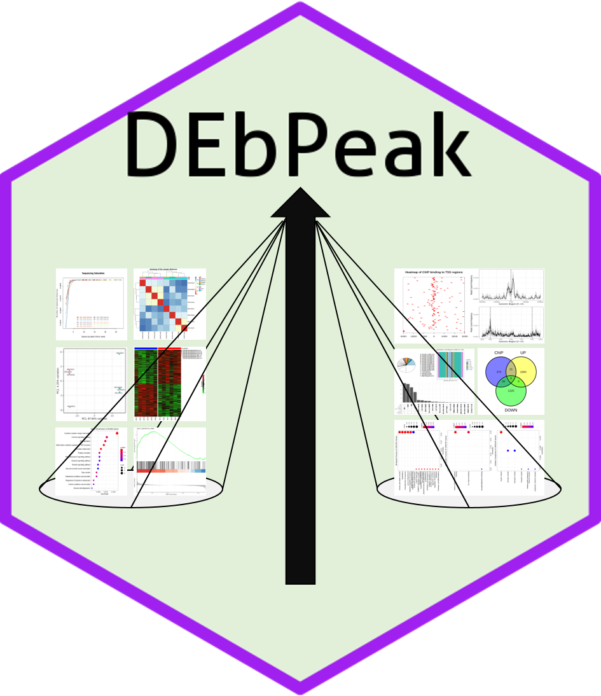
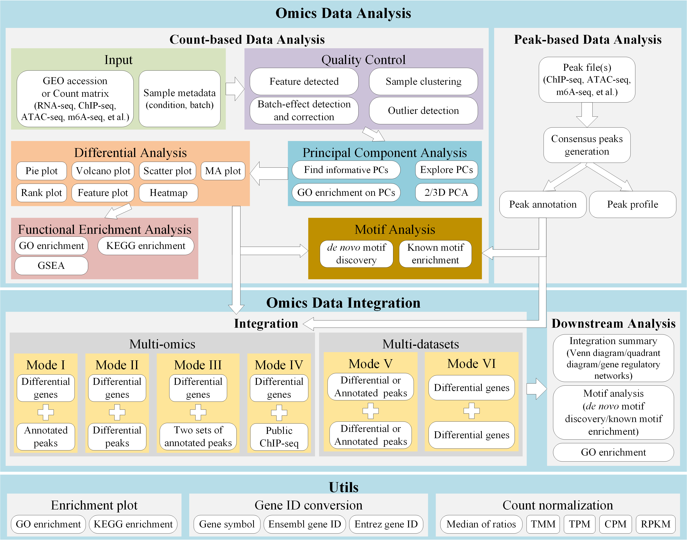

<style type="text/css" rel="stylesheet">
.table {
  margin-left: auto;
  margin-right: auto;
}

td, th {
  border: 1px solid #ddd;
  padding: 8px;
}

tr:nth-child(even){background-color: #f2f2f2;}

tr:hover {background-color: #ddd;}

th {
  padding-top: 12px;
  padding-bottom: 12px;
  text-align: left;
  background-color: #04AA6D;
  color: white;
}
</style>

# DEbPeak - Explore, visualize, interpret RNA-seq data and unravel the regulation of gene expression.



## Introduction
`DEbPeak` aims to **explore**, **visualize**, **interpret** RNA-seq data and **unravel the regulation of gene expression** by combining ChIP-seq and ATAC-seq data. It contains **six functional modules**:

* **Quality Control (QC)**: QC on count matrix and samples. 
  - QC on count matrix: Proportion of genes detected in different samples under different CPM thresholds and the saturation of the number of genes detected.
  - QC on samples: Euclidean distance and pearson correlation coefficient of samples across different conditions, sample similarity on selected principal components (check batch information and conduct batch correction) and outlier detection with robust PCA.
* **Principal Component Analysis (PCA)**: this module can be divided into three sub modules, basic info, loading related and 3D visualization.
  - Basic info: scree plot (help to select the useful PCs), biplot (sample similarity with corresponding genes with larger loadings) and PC pairs plot (sample similarity under different PC combinations).
  - Loading related: visualize genes with larger positive and negative loadings on selected PCs, conduct GO enrichment analysis on genes with larger positive and negative loadings on selected PCs.
  - 3D visualization: visualize samples on three selected PCs.
* **Differential Expression Gene Visualization**: this module includes six powerful visualization methods (Volcano Plot, Scatter Plot, MA Plot, Rank Plot, Gene Plot, Heatmap).
* **Functional Enrichment Analysis (FEA)**: GO enrichment analysis, KEGG enrichment analysis, Gene Set Enrichment Analysis (GSEA).
  - GO (Biological Process, Molecular Function, Cellular Component) and KEGG on differential expression genes
  - GSEA on all genes
* **Integrate with ChIP-seq/ATAC-seq**: 
  - Get consensus peaks: For multiple peak files, get consensus peaks; for single peak file, use it directly
  - Peak profile plots: Heatmap of peak binding to TSS regions, Average Profile of ChIP peaks binding to TSS region, Profile of ChIP peaks binding to different regions.
  - Peak annotaion
  - Integrate RNA-seq and ChIP-seq/ATAC-seq: Integrate RNA-seq and ChIP-seq/ATAC-seq to find direct targets, including up-regulated and down-regulated.
  - Integrate summary: Summary the integrated results, get the overlap number of up-regulated genes and ChIP-seq/ATAC-seq results (UP), down-regulated genes and ChIP-seq/ATAC-seq results.
  - GO enrichment on integrated results: GO enrichment on up-regulated targets and down-regulated targets.
  - Find motif on integrated results: This is a step unique to ATAC-seq. Due to the nature of ATAC-seq, we usually need to find motif on integrated results to obtain potential regulatory factors.
* **Utils**: useful functions when dealing with RNA-seq data, including gene name conversion and count normalization(DESeq2’s median of ratios, TMM, CPM, TPM, RPKM).

To enhance the ease of use of the tool, we have also developed an **web server** for `DEbPeak` that allows users to submit files to the web page and set parameters to get the desired results. Unlike the standalone R package, *the web server has built-in `DESeq2` for differential expression analysis*, while the R package can accept user input results from `DESeq2` or `edgeR`, which will be **more flexible**.

By the way, all plots generated are **publication-ready** , and most of them are based on `ggplot2`, so that users can easily modify them according to their needs. We also provide **various color palettes**, including **discrete** and **continuous**, **color blind friendly** and **multiple categorical variables**.

<hr />

## Framework
<div align="center">

</div>

## Installation
You can install the package via the Github repository:

``` r
# install.package("remotes")   #In case you have not installed it.
remotes::install_github("showteeth/DEbPeak")
```

In general, it is **recommended** to install from [Github repository](https://github.com/showteeth/DEbPeak) (update more timely).

<hr />

## Usage
### Vignette
Detailed usage is available in [here](https://showteeth.github.io/DEbPeak/). `DEbPeak` provides eight vignettes:

* [Quality Control](https://showteeth.github.io/DEbPeak/articles/QualityControl.html)
* [Principal Component Analysis](https://showteeth.github.io/DEbPeak/articles/PrincipalComponentAnalysis.html)
* [Differential Expression Analysis](https://showteeth.github.io/DEbPeak/articles/DifferentialExpressionAnalysis.html)
* [Functional Enrichment Analysis](https://showteeth.github.io/DEbPeak/articles/FunctionalEnrichmentAnalysis.html)
* [Integrate RNA-seq and ChIP-seq](https://showteeth.github.io/DEbPeak/articles/IntegrateChIP.html)
* [Integrate RNA-seq and ATAC-seq](https://showteeth.github.io/DEbPeak/articles/IntegrateATAC.html)
* [Integrate RNA-seq ChIP-seq and ATAC-seq](https://showteeth.github.io/DEbPeak/articles/IntegrateChIPATAC.html)
* [Utils](https://showteeth.github.io/DEbPeak/articles/Utils.html)

### Function list
<table>
<thead>
  <tr>
    <th>Type</th>
    <th>Function</th>
    <th>Usage</th>
  </tr>
</thead>
<tbody>
  <tr>
    <td rowspan="4">Quality Control</td>
    <td><code>CountQC</code></td>
    <td>Quality control on count matrix</td>
  </tr>
  <tr>
    <td><code>SampleRelation</code></td>
    <td>Quality control on samples</td>
  </tr>
  <tr>
    <td><code>OutlierDetection</code></td>
    <td>Detect outlier with robust PCA</td>
  </tr>
  <tr>
    <td><code>QCPCA</code></td>
    <td>PCA related functions used in quality control (batch correction and outlier detection)</td>
  </tr>
  <tr>
    <td rowspan="6">Principal Component Analysis</td>
    <td><code>PCA</code></td>
    <td>Conduct principal component analysis</td>
  </tr>
  <tr>
    <td><code>PCABasic</code></td>
    <td>Generated PCA baisc plots, including screen plot, biplot and pairs plot</td>
  </tr>
  <tr>
    <td><code>ExportPCGenes</code></td>
    <td>Export genes of selected PCs</td>
  </tr>
  <tr>
    <td><code>LoadingPlot</code></td>
    <td>PCA loading plot, including bar and heatmap</td>
  </tr>
  <tr>
    <td><code>LoadingGO</code></td>
    <td>GO enrichment on PC's loading genes</td>
  </tr>
  <tr>
    <td><code>PCA3D</code></td>
    <td>Create 3D PCA plot</td>
  </tr>
  <tr>
    <td rowspan="8">Differential Axpression Analysis</td>
    <td><code>ExtractDEG</code></td>
    <td>Extract Differentially Expressed Genes</td>
  </tr>
  <tr>
    <td><code>VolcanoPlot</code></td>
    <td>VolcanoPlot for Differentially Expressed Genes</td>
  </tr>
  <tr>
    <td><code>ScatterPlot</code></td>
    <td>ScatterPlot for Differentially Expressed Genes</td>
  </tr>
  <tr>
    <td><code>MAPlot</code></td>
    <td>MA-plot</td>
  </tr>
  <tr>
    <td><code>RankPlot</code></td>
    <td>Rank plot for Differentially Expressed Genes</td>
  </tr>
  <tr>
    <td><code>GenePlot</code></td>
    <td>Gene expresion plot</td>
  </tr>
  <tr>
    <td><code>DEHeatmap</code></td>
    <td>Heatmap for Differentially Expressed Genes</td>
  </tr>
  <tr>
    <td><code>ConductDESeq2</code></td>
    <td>Conduct Differential Axpression Analysis with DESeq2</td>
  </tr>
  <tr>
    <td rowspan="3">Functional Enrichment Analysis</td>
    <td><code>ConductFE</code></td>
    <td>Conduct Functional Enrichment Analysis (GO and KEGG)</td>
  </tr>
  <tr>
    <td><code>ConductGSEA</code></td>
    <td>Conduct Gene Set Enrichment Analysis (GSEA)</td>
  </tr>
  <tr>
    <td><code>VisGSEA</code></td>
    <td>Visualize GSEA results</td>
  </tr>
  <tr>
    <td rowspan="9">Integrate with ChIP-seq/ATAC-seq</td>
    <td><code>GetConsensusPeak</code></td>
    <td>Get Consensus Peak with MSPC</td>
  </tr>
  <tr>
    <td><code>PeakProfile</code></td>
    <td>Create Peak Peak Binding Profile</td>
  </tr>
  <tr>
    <td><code>AnnoPeak</code></td>
    <td>Conduct Peak Annotation</td>
  </tr>
  <tr>
    <td><code>PeakAnnoPie</code></td>
    <td>Create Peak Annotation Pie Plot with ggplot2</td>
  </tr>
  <tr>
    <td><code>DEbPeak</code></td>
    <td>Integrate Differential Expression Results and Peak Annotation Results (ATAC-seq or ChIP-seq)</td>
  </tr>
  <tr>
    <td><code>PlotDEbPeak</code></td>
    <td>Create Integrated Summary Plot</td>
  </tr>
  <tr>
    <td><code>DEbPeakFE</code></td>
    <td>GO Enrichment on Integrated Results</td>
  </tr>
  <tr>
    <td><code>FindMotif</code></td>
    <td>Find motif on integrated results (RNA-seq and ATAC-seq)</td>
  </tr>
  <tr>
    <td><code>DEbCA</code></td>
    <td>Integrate Differential Expression Results and Peak Annotation Results (Both ATAC-seq and ChIP-seq)</td>
  </tr>
  <tr>
    <td rowspan="2">Utils</td>
    <td><code>IDConversion</code></td>
    <td>Gene ID Conversion</td>
  </tr>
  <tr>
    <td><code>NormalizedCount</code></td>
    <td>Perform Counts Normalization (DESeq2, TMM, CPM, RPKM, TPM).</td>
  </tr>
</tbody>
</table>

<hr />

## Contact
For any question, feature request or bug report please write an email to songyb0519@gmail.com.

<hr />

## Code of Conduct
Please note that the DEbPeak project is released with a [Contributor Code of Conduct](https://contributor-covenant.org/version/2/0/CODE_OF_CONDUCT.html). By contributing to this project, you agree to abide by its terms.

<hr />


