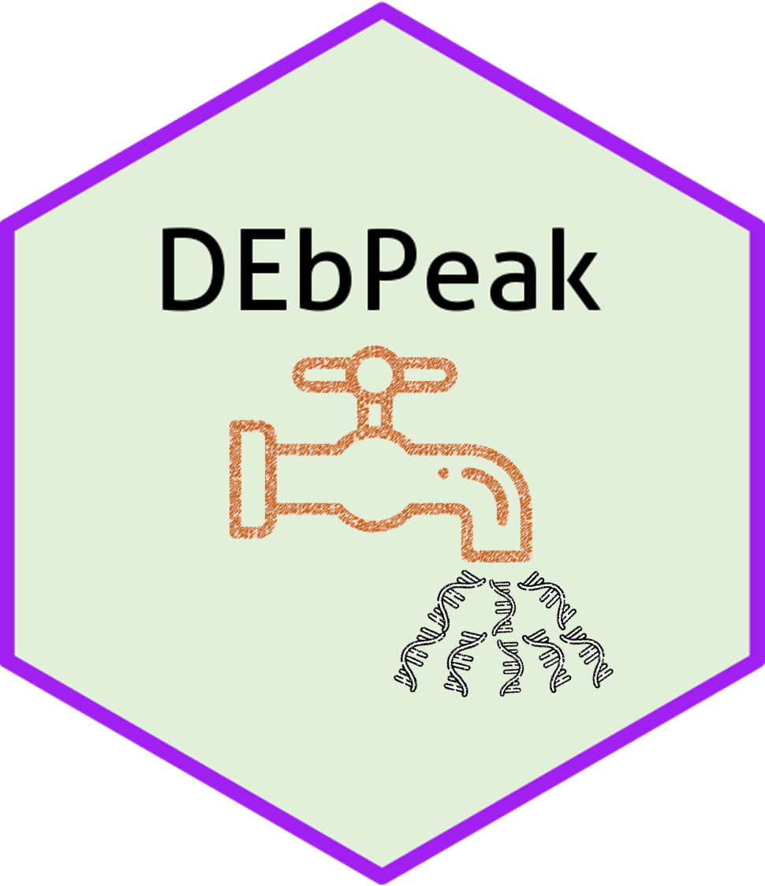

# DEbPeak - Analyze and integrate multi-omics to unravel the regulation of gene expression.



 
[](https://github.com/showteeth/DEbPeak)

## Introduction
`DEbPeak` aims to **explore**, **visualize**, **interpret** multi-omics data and **unravel the regulation of gene expression** by combining RNA-seq with peak-related data (eg: ChIP-seq, ATAC-seq, m6a-seq et al.). It contains **eleven functional modules**:

* **Parse GEO**: Extract study information, raw count matrix and metadata from GEO database.
* **Quality Control (QC)**: QC on count matrix and samples. 
  - QC on count matrix: Proportion of genes detected in different samples under different CPM thresholds and the saturation of the number of genes detected.
  - QC on samples: Euclidean distance and pearson correlation coefficient of samples across different conditions, sample similarity on selected principal components (check batch information and conduct batch correction) and outlier detection with robust PCA.
* **Principal Component Analysis (PCA)**: this module can be divided into three sub modules, basic info, loading related and 3D visualization.
  - Basic info: scree plot (help to select the useful PCs), biplot (sample similarity with corresponding genes with larger loadings) and PC pairs plot (sample similarity under different PC combinations).
  - Loading related: visualize genes with larger positive and negative loadings on selected PCs, conduct GO enrichment analysis on genes with larger positive and negative loadings on selected PCs.
  - 3D visualization: visualize samples on three selected PCs.
* **Differential Analysis and Visualization**: this module includes seven powerful visualization methods (Volcano Plot, Scatter Plot, MA Plot, Rank Plot, Gene/Peak Plot, Heatmap, Pie Plot for peak-related data).
* **Functional Enrichment Analysis (FEA)**: GO enrichment analysis, KEGG enrichment analysis, Gene Set Enrichment Analysis (GSEA).
  - GO (Biological Process, Molecular Function, Cellular Component) and KEGG on differential expression genes or accessible/binding peaks.
  - GSEA on all genes (Notice: GSEA is not available for peak-related data)
* **Predict transcription factors (PredictTFs)**: Identify transcription factors with differentially expressed genes, `DEbPeak` provides three methods ([BART](https://academic.oup.com/bioinformatics/article/34/16/2867/4956015?login=false), [ChEA3](https://www.ncbi.nlm.nih.gov/pmc/articles/PMC6602523) and [TFEA.ChIP](https://academic.oup.com/bioinformatics/article/35/24/5339/5538988)).
* **Motif analysis**:
  - *de novo* motif discovery
  - motif enrichment
* **Integrate RNA-seq with peak-related data**: 
  - Get consensus peaks: For multiple peak files, get consensus peaks; for single peak file, use it directly (used in consensus integration mode).
  - Peak profile plots: Heatmap of peak binding to TSS regions, Average Profile of ChIP peaks binding to TSS region, Profile of ChIP peaks binding to different regions (used in consensus integration mode).
  - Peak annotaion (used in consensus integration mode).
  - Integrate RNA-seq with peak-related data (consensus mode): Integrate RNA-seq with peak-related data to find direct targets, including up-regulated and down-regulated.
  - Integrate RNA-seq with peak-related data (differential mode): Integrate RNA-seq and peak-related data based on differential analysis.
  - Integration summary: include venn diagram and quadrant diagram (differential mode).
  - GO enrichment on integrated results.
  - Find motif on integrated results: Due to the nature of ATAC-seq, we usually need to find motif on integrated results to obtain potential regulatory factors.
* **Integrate RNA-seq with RNA-seq**:
  - Integration summary: include venn diagram and quadrant diagram.
  - GO enrichment on integrated results.
* **Integrate peak-related data with peak-related data**:
  - Integration summary: include venn diagram and quadrant diagram (differential mode).
  - GO enrichment on integrated results.
* **Utils**: useful functions, including creating enrichment plot for selected enrichment terms, gene ID conversion and count normalization(DESeq2’s median of ratios, TMM, CPM, TPM, RPKM).

To enhance the ease of use of the tool, we have also developed an **web server** for `DEbPeak` that allows users to submit files to the web page and set parameters to get the desired results. Unlike the standalone R package, *the web server has built-in `DESeq2` for differential analysis*, while the R package can accept user input results from `DESeq2` or `edgeR`, which will be **more flexible**.

By the way, all plots generated are **publication-ready** , and most of them are based on `ggplot2`, so that users can easily modify them according to their needs. We also provide **various color palettes**, including **discrete** and **continuous**, **color blind friendly** and **multiple categorical variables**.

<hr />

## Framework
<div align="center">

</div>

## Installation
You can install the package via the Github repository:

``` r
# install.package("remotes")   #In case you have not installed it.
remotes::install_github("showteeth/DEbPeak")
```

In general, it is **recommended** to install from [Github repository](https://github.com/showteeth/DEbPeak) (update more timely).

<hr />

## Usage
### Vignette

Detailed usage is available in [here](https://showteeth.github.io/DEbPeak/). We divide these vignettes into four categories:

* For parse **GEO**:
  * [Parse GEO](https://showteeth.github.io/DEbPeak/articles/ParseGEO.html)

* For analyzing **RNA-seq**:
  * [Quality Control](https://showteeth.github.io/DEbPeak/articles/QualityControl.html)
  * [Principal Component Analysis (RNA-seq)](https://showteeth.github.io/DEbPeak/articles/PrincipalComponentAnalysis.html)
  * [Differential Expression Analysis (RNA-seq)](https://showteeth.github.io/DEbPeak/articles/DifferentialExpressionAnalysis.html)
  * [Functional Enrichment Analysis (RNA-seq)](https://showteeth.github.io/DEbPeak/articles/FunctionalEnrichmentAnalysis.html)
  * [Predict Transcription Factors (RNA-seq)](https://showteeth.github.io/DEbPeak/articles/IdentifyRegulator.html)
  * [Utils](https://showteeth.github.io/DEbPeak/articles/Utils.html)

* For analyzing **peak-related data**:
  * [Quality Control](https://showteeth.github.io/DEbPeak/articles/QualityControl.html)
  * [Principal Component Analysis (Peak-related)](https://showteeth.github.io/DEbPeak/articles/PrincipalComponentAnalysisPeak.html)
  * [Differential Analysis (Peak-related)](https://showteeth.github.io/DEbPeak/articles/DifferentialExpressionAnalysisPeak.html)
  * [Functional Enrichment Analysis (Peak-related)](https://showteeth.github.io/DEbPeak/articles/FunctionalEnrichmentAnalysisPeak.html)
  * [Motif Analysis (Peak-related)](https://showteeth.github.io/DEbPeak/articles/MotifEnrichment.html)

* **Integrating RNA-seq (differential expression analysis) with peak-related data (consensus peak)**:
  * [Integrate RNA-seq with ChIP-seq (consensus peak)](https://showteeth.github.io/DEbPeak/articles/IntegrateChIP.html)
  * [Integrate RNA-seq with ATAC-seq (consensus peak)](https://showteeth.github.io/DEbPeak/articles/IntegrateATAC.html)
  * [Integrate RNA-seq ChIP-seq and ATAC-seq](https://showteeth.github.io/DEbPeak/articles/IntegrateChIPATAC.html)

* **Integrating RNA-seq (differential expression analysis) with peak-related data (differential accessible/binding analysis)**:
  * [Integrate RNA-seq with ATAC-seq (differential analysis)](https://showteeth.github.io/DEbPeak/articles/IntegrateATACDE.html)
  * [Integrate RNA-seq with ChIP-seq (differential analysis)](https://showteeth.github.io/DEbPeak/articles/IntegrateChIPDE.html).


### Function list

<table>
<thead>
  <tr>
    <th>Type</th>
    <th>Function</th>
    <th>Description</th>
    <th>Key packages</th>
  </tr>
</thead>
<tbody>
  <tr>
    <td>Parse GEO</td>
    <td>ParseGEO</td>
    <td>Extract study information, raw count matrix and metadata from GEO database</td>
    <td>GEOquery</td>
  </tr>
  <tr>
    <td rowspan="4">Quality Control</td>
    <td>CountQC</td>
    <td>Quality control on count matrix (gene detection sensitivity and sequencing depth saturation)</td>
    <td>NOISeq</td>
  </tr>
  <tr>
    <td>SampleRelation</td>
    <td>Quality control on samples (sample clustering based on euclidean distance and pearson correlation coefficient)</td>
    <td>stats</td>
  </tr>
  <tr>
    <td>OutlierDetection</td>
    <td>Detect outlier with robust PCA</td>
    <td>rrcov</td>
  </tr>
  <tr>
    <td>QCPCA</td>
    <td>PCA related functions used in quality control (batch detection and correction, outlier detection)</td>
    <td>stats, sva, rrcov</td>
  </tr>
  <tr>
    <td rowspan="6">Principal Component Analysis</td>
    <td>PCA</td>
    <td>Conduct principal component analysis</td>
    <td>stats</td>
  </tr>
  <tr>
    <td>PCABasic</td>
    <td>Generated PCA baisc plots, including screen plot, biplot and pairs plot</td>
    <td>PCAtools</td>
  </tr>
  <tr>
    <td>ExportPCGenes</td>
    <td>Export genes of selected PCs</td>
    <td>tidyverse</td>
  </tr>
  <tr>
    <td>LoadingPlot</td>
    <td>PCA loading plot, including bar plot and heatmap</td>
    <td>ggplot2, ComplexHeatmap</td>
  </tr>
  <tr>
    <td>LoadingGO</td>
    <td>GO enrichment on PC’s loading genes</td>
    <td>clusterProfiler</td>
  </tr>
  <tr>
    <td>PCA3D</td>
    <td>Create 3D PCA plot</td>
    <td>plot3D</td>
  </tr>
  <tr>
    <td rowspan="9">Differential Analysis</td>
    <td>ExtractDA</td>
    <td>Extract differential analysis results</td>
    <td>tidyverse</td>
  </tr>
  <tr>
    <td>VolcanoPlot</td>
    <td>VolcanoPlot for differential analysis results</td>
    <td>ggplot2</td>
  </tr>
  <tr>
    <td>ScatterPlot</td>
    <td>ScatterPlot for differential analysis results</td>
    <td>ggplot2</td>
  </tr>
  <tr>
    <td>MAPlot</td>
    <td>MA-plot for differential analysis results</td>
    <td>ggplot2</td>
  </tr>
  <tr>
    <td>RankPlot</td>
    <td>Rank plot for differential analysis results</td>
    <td>ggplot2</td>
  </tr>
  <tr>
    <td>GenePlot</td>
    <td>Gene expresion or peak accessibility/binding plot</td>
    <td>ggplot2</td>
  </tr>
  <tr>
    <td>DEHeatmap</td>
    <td>Heatmap for differential analysis results</td>
    <td>ComplexHeatmap</td>
  </tr>
  <tr>
    <td>DiffPeakPie</td>
    <td>Stat genomic regions of differential peaks with pie plot</td>
    <td>ggpie</td>
  </tr>
  <tr>
    <td>ConductDESeq2</td>
    <td>Conduct differential analysis with DESeq2</td>
    <td>NOISeq, stats, sva, rrcov, PCAtools, DESeq2, ggplot2, ComplexHeatmap, clusterProfiler, plot3D, tidyverse</td>
  </tr>
  <tr>
    <td rowspan="3">Functional Enrichment Analysis</td>
    <td>ConductFE</td>
    <td>Conduct functional enrichment analysis (GO and KEGG)</td>
    <td>clusterProfiler</td>
  </tr>
  <tr>
    <td>ConductGSEA</td>
    <td>Conduct gene set enrichment analysis (GSEA)</td>
    <td>clusterProfiler</td>
  </tr>
  <tr>
    <td>VisGSEA</td>
    <td>Visualize GSEA results</td>
    <td>enrichplot</td>
  </tr>
  <tr>
    <td rowspan="2">Predict Transcription Factors</td>
    <td>InferRegulator</td>
    <td>Predict TFs&nbsp;&nbsp;&nbsp;from RNA-seq data with ChEA3, BART2 and TFEA.ChIP</td>
    <td>ChEA3, BART2,&nbsp;&nbsp;&nbsp;TFEA.ChIP</td>
  </tr>
  <tr>
    <td>VizRegulator</td>
    <td>Visualize the&nbsp;&nbsp;&nbsp;Identified TFs</td>
    <td>ggplot2</td>
  </tr>
  <tr>
    <td rowspan="3">Motif Analysis</td>
    <td>MotifEnrich</td>
    <td>Motif enrichment for differentially accessible/binding peaks</td>
    <td>HOMER</td>
  </tr>
  <tr>
    <td>MotifDiscovery</td>
    <td>de novo motif discovery with STREME</td>
    <td>MEME</td>
  </tr>
  <tr>
    <td>MotifCompare</td>
    <td>Map motifs against a motif database with Tomtom</td>
    <td>MEME</td>
  </tr>
  <tr>
    <td rowspan="5">Peak-related Analysis</td>
    <td>PeakMatrix</td>
    <td>Prepare count matrix and sample metadata for peak-related data</td>
    <td>DiffBind, ChIPseeker</td>
  </tr>
  <tr>
    <td>GetConsensusPeak</td>
    <td>Get consensus peak from replicates</td>
    <td>MSPC</td>
  </tr>
  <tr>
    <td>PeakProfile</td>
    <td>Visualize peak accessibility/binding profile</td>
    <td>ChIPseeker</td>
  </tr>
  <tr>
    <td>AnnoPeak</td>
    <td>Assign peaks with the genomic binding region and nearby genes</td>
    <td>ChIPseeker</td>
  </tr>
  <tr>
    <td>PeakAnnoPie</td>
    <td>Visualize peak annotation results with pie plot</td>
    <td>ggpie</td>
  </tr>
  <tr>
    <td rowspan="8">Integrate RNA-seq with Peak-related Data</td>
    <td>DEbPeak</td>
    <td>Integrate differential expression results and peak annotation/differential expression results.</td>
    <td>tidyverse</td>
  </tr>
  <tr>
    <td>DEbPeakFE</td>
    <td>GO enrichment on integrated results</td>
    <td>clusterProfiler</td>
  </tr>
  <tr>
    <td>DEbCA</td>
    <td>Integrate differential expression results and peak annotation results (two kinds of peak-related data)</td>
    <td>tidyverse</td>
  </tr>
  <tr>
    <td>ProcessEnhancer</td>
    <td>Get genes near differential peaks</td>
    <td>IRanges</td>
  </tr>
  <tr>
    <td>InteVenn</td>
    <td>Create a Venn   diagram for integrated results (support DEbPeak, DEbDE, PeakbPeak)</td>
    <td>ggvenn</td>
  </tr>
  <tr>
    <td>InteDiffQuad</td>
    <td>Create quadrant diagram for differential expression analysis of RNA-seq and peak-related data</td>
    <td>ggplot2</td>
  </tr>
  <tr>
    <td>NetViz</td>
    <td>Visualize&nbsp;&nbsp;&nbsp;enhancer-gene network results</td>
    <td>igraph,&nbsp;&nbsp;&nbsp;ggnetwork</td>
  </tr>
  <tr>
    <td>FindMotif</td>
    <td>Find motif on integrated results</td>
    <td>HOMER</td>
  </tr>
  <tr>
    <td rowspan="2">Integrate RNA-seq with RNA-seq</td>
    <td>DEbDE</td>
    <td>Integrate Two Differential Expression Results</td>
    <td>tidyverse</td>
  </tr>
  <tr>
    <td>DEbDEFE</td>
    <td>GO Enrichment on Two Differential Expression Integration Results.</td>
    <td>clusterProfiler</td>
  </tr>
  <tr>
    <td rowspan="2">Integrate Peak-related Data with Peak-related Data</td>
    <td>PeakbPeak</td>
    <td>Integrate Two Peak Annotation/Differential Analysis Results.</td>
    <td>tidyverse</td>
  </tr>
  <tr>
    <td>PeakbPeakFE</td>
    <td>GO Enrichment on Two Peak Annotation/Differential Analysis Integration Results.</td>
    <td>clusterProfiler</td>
  </tr>
  <tr>
    <td rowspan="4">Utils<br><br></td>
    <td>EnrichPlot</td>
    <td>Create a bar or&nbsp;&nbsp;&nbsp;dot plot for selected functional enrichment analysis results (GO and KEGG)</td>
    <td>ggplot2</td>
  </tr>
  <tr>
    <td>IDConversion</td>
    <td>Gene ID conversion between ENSEMBL ENTREZID SYMBOL</td>
    <td>clusterProfiler</td>
  </tr>
  <tr>
    <td>GetGeneLength</td>
    <td>Get gene length from GTF</td>
    <td>GenomicFeatures, GenomicRanges</td>
  </tr>
  <tr>
    <td>NormalizedCount</td>
    <td>Perform counts normalization (DESeq2’s median of ratios, TMM, CPM, RPKM, TPM)</td>
    <td>DESeq2, edgeR, tidyverse</td>
  </tr>
</tbody>
</table>

<hr />

## Notice

* The **KEGG API** has changed, to perform KEGG enrichment, you'd better update `clusterProfiler` >= `4.7.1`. 

<hr />

## Contact
For any question, feature request or bug report please write an email to songyb0519@gmail.com.

<hr />

## Code of Conduct
Please note that the DEbPeak project is released with a [Contributor Code of Conduct](https://contributor-covenant.org/version/2/0/CODE_OF_CONDUCT.html). By contributing to this project, you agree to abide by its terms.

<hr />


